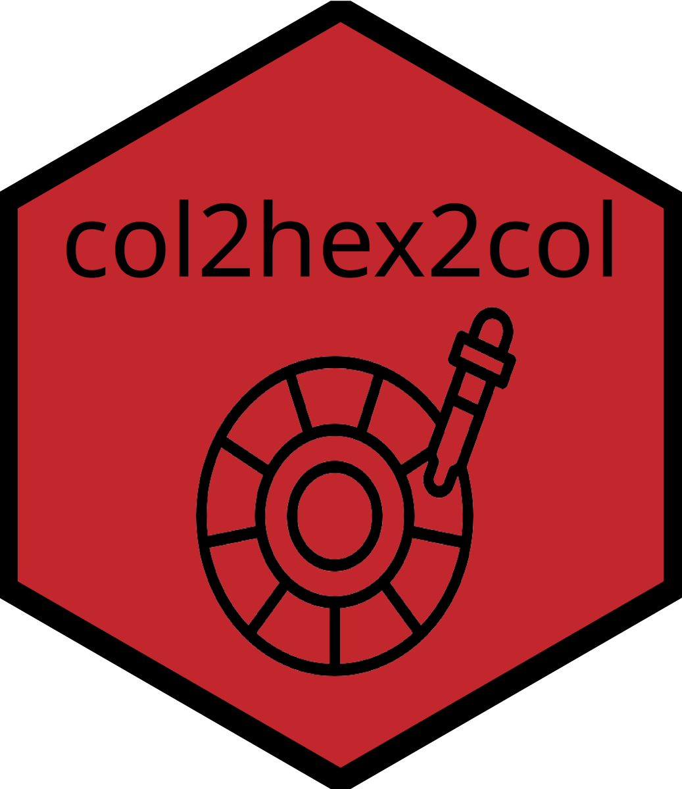

# col2hex2col 

<!-- badges: start -->
[](https://github.com/AnttiRask/col2hex2col/actions)
[](https://CRAN.R-project.org/package=col2hex2col)
[](https://lifecycle.r-lib.org/articles/stages.html#stable)
<!-- badges: end -->

## Overview

**col2hex2col** provides fast and simple functions to convert between color names and hexadecimal color codes. The package now supports an extensive database of over **32,000 color names**, including all 657 R built-in colors plus the comprehensive color-names database.

The name is a playful reference to "2 Fast 2 Furious" - because color conversion should be both fun and fast!

## Installation

You can install the development version from GitHub:

```r
# install.packages("devtools")
devtools::install_github("AnttiRask/col2hex2col")
```

## Usage

### Convert color names to hex codes

```r
library(col2hex2col)

# Single color
color_to_hex("red")
#> [1] "#FF0000"

# Multiple colors
color_to_hex(c("red", "blue", "green"))
#> [1] "#FF0000" "#0000FF" "#00FF00"

# Works with all 657 R color names
color_to_hex(c("skyblue", "coral", "chartreuse"))
#> [1] "#87CEEB" "#FF7F50" "#7FFF00"

# Also works with 32,000+ extended color names!
color_to_hex(c("sunset orange", "arctic ocean"))
#> [1] "#FD5E53" "#66C3D0"
```

### Convert hex codes to color names

```r
# Single hex code
hex_to_color("#FF0000")
#> [1] "red"

# Multiple hex codes
hex_to_color(c("#FF0000", "#0000FF", "#00FF00"))
#> [1] "red"   "blue"  "green"

# Case insensitive
hex_to_color("#ff0000")
#> [1] "red"
```

### Round-trip conversion

```r
# Color -> Hex -> Color
colors <- c("red", "blue", "green")
hex_codes <- color_to_hex(colors)
hex_to_color(hex_codes)
#> [1] "red"   "blue"  "green"
```

### Color space conversions

#### HSL

HSL (Hue, Saturation, Lightness) represents colors in a cylindrical model that is
intuitive for tweaking hue and lightness by hand. Reference: [MDN HSL](https://developer.mozilla.org/en-US/docs/Web/CSS/Reference/Values/color_value/hsl)

```r
# Hex -> HSL -> color name
hex_to_hsl("#87CEEB") |> hsl_to_color()
#> [1] "skyblue"
```

#### OKLab

OKLab is a perceptually uniform color space designed for modern displays and
more consistent visual differences. Reference: [MDN OKLab](https://developer.mozilla.org/en-US/docs/Web/CSS/Reference/Values/color_value/oklab)

```r
# Hex -> OKLab -> color name
hex_to_oklab("#8A2BE2") |> oklab_to_color()
#> [1] "blueviolet"
```

#### OKLCH

OKLCH is the cylindrical form of OKLab, making it easier to reason about hue
and chroma while keeping perceptual uniformity. Reference: [MDN OKLCH](https://developer.mozilla.org/en-US/docs/Web/CSS/Reference/Values/color_value/oklch)

```r
# Hex -> OKLCH -> color name
hex_to_oklch("#FD5E53") |> oklch_to_color()
#> [1] "sunset orange"
```

### Roundtrip around the (color) world 🎨

```r
# Start from hex codes (without #) and normalize
hex <- paste0("#", c("ffffff", "000000"))

roundtrip <- hex |>
  hex_to_color() |>
  color_to_hex() |>
  hex_to_hsl() |>
  hsl_to_hex() |>
  hex_to_oklch() |>
  oklch_to_hex() |>
  hex_to_color() |>
  color_to_hex() |>
  hex_to_oklab() |>
  oklab_to_color()

roundtrip
#> [1] "black" "white"
```

### Explore and visualize the color database

```r
# Get all 32,462 colors as a data frame
colors_df <- get_color_data()
head(colors_df)
#>           name     hex
#> 1    aaron blue #6FC6E0
#> 2 abbey purple #73607C
#> 3   aberdonian #4D6767
#> 4    aborigine #A99B85
#> 5    aboukir   #8BA58F
#> 6    abraxas   #5B6E91

# Find specific colors
blue_colors <- colors_df[grepl("blue", colors_df$name), ]
nrow(blue_colors)
#> [1] 1517

# Create a beautiful color swatch table (requires gt package)
create_color_table(head(colors_df, 9))
```


The `create_color_table()` function creates an interactive table with visual color swatches, making it easy to explore and select colors for your projects.

## Features

- **Extensive Database**: 32,000+ color names including all R colors and the color-names database
- **Data Export**: Access the complete color database as a data frame for exploration and analysis
- **Visual Tables**: Create beautiful color swatch tables with the optional gt package
- **Fast**: Pre-built lookup tables for instant color conversion
- **Simple**: Four intuitive functions to remember
- **Backward Compatible**: R colors are prioritized, ensuring existing code works unchanged
- **Case Insensitive**: "Red", "red", and "RED" all work the same
- **Vectorized**: Works with single values or vectors
- **Validated**: Comprehensive input validation and error messages
- **Tested**: Extensive test coverage with testthat (111 tests)

## Why col2hex2col?

- **Zero dependencies**: Pure base R implementation with no external dependencies
- **Extensive coverage**: 32,000+ color names vs ~657 in base R
- **Optimized performance**: Pre-built lookup tables for instant conversion
- **Backward compatible**: R colors are prioritized, ensuring existing code works
- **Well-documented**: Complete function documentation and examples

## Acknowledgments

- The `create_color_table()` function was inspired by a question from [Nehal Darakhshan](https://github.com/darakhshannehal) on LinkedIn about visualizing color palettes. Thank you!
- The extended color database (32,000+ colors) comes from [David Aerne's color-names project](https://github.com/meodai/color-names). Thank you for maintaining this excellent resource!

## Code of Conduct

Please note that this project is released with a [Contributor Code of Conduct](https://contributor-covenant.org/version/2/1/CODE_OF_CONDUCT.html). By contributing to this project, you agree to abide by its terms.

## License

MIT © Antti Rask
